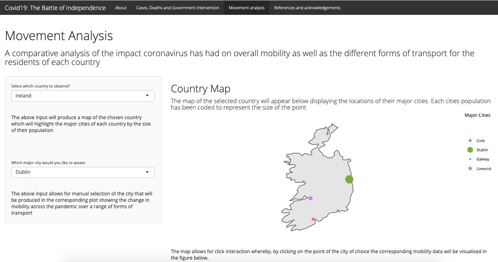

 

## What is _"Covid19: The Battle of Independence"_ app all about?

 

The _"Covid19: The Battle of Independence""_ is an application that focuses on comparative analysis of the impact and response to corona virus between Ireland and the United Kingdom. As detailed in the _"About"_ section, there is a long standing and divisive history of conflict and war between the two countries that stems from Ireland's plight for seeking their independence from the United Kingdom. Corona virus has presented pundits who are pro independence  with a case study to further ignite and push the fight for independence, with the difference in impact and response between Ireland and the United Kingdom acting as a proxy for Ireland's ability to stand completely independent.As a follow on from my blog post [_"Success in the face of coronavirus? Maybe."_](http://127.0.0.1:4321/post/blog_two/blog-post-two-ireland/) this application provides the user with interactive tools to analyse and compare a range of corona virus statistics and responses between the two countries and assess the case study for themselves. 

 

## Where can you go?

This application provides four web pages that the user can navigate across by accessing the navigation bar that can be found along the top border of the app. The navigation bar list four separate sections, they are:

  1. _About_ 
  2. _Cases, Deaths and Government Intervention_
  3. _Movement Analysis_
  4. _References and acknowledgements_
  
 

## What can you learn?
 

#### About page

The application opens up on the _"About" page which provides the user with an informative breakdown of the purpose behind building the app by succinctly detailing the history between Ireland and the United Kingdom and the how corona virus is being used as a case study to fuel the plight of for complete Irish independence. As well. as providing information on the creator of the application.
  
 
  
#### Cases, Deaths and Government Intervention 

This section contains an interactive comparative analysis between the two countries across each of the following four statistics: 
  
  1. Daily Cases 
  2. Daily Deaths 
  3. Cumulative cases 
  4. Cumulative deaths 
  4. Government intervention (through restrictions, measures and public policy). 

The page is split into two halves, one being the side bar panel on the left hand side providing the user with interactive selection capabilities whereby the selection made will be presented in the main panel in the form of a figure visualizing any one of the chosen statistics or a table detailing the government intervention for either both or one of Ireland or Great Britain. 

As expressed, the user has the opportunity to select the statistic that they wish to comparatively analyse from the side bar panel and that will automatically update the  interactive figure on the main page with a comparison between Ireland and Great Britain for the chosen statistic. As shown in Figure 2, the output presents a time series line plot with the data on the x axis and the specific count or government measure on the y axis. The figure offers the user extensive interactive capabilities for them to explore the data and conduct analysis. By hovering over the corresponding line plots of the they can access information regarding: date and number of restriction/government measures in place for each nation. Furthermore, the figure offers the ability to zoom in on any section of the plot allowing the user to highlight and manipulate the plot as they please and by clicking the country names in the legend, titled Countries, the plot can be isolated for one country and the chosen variable can be individually analysed. The drop down selection box at the top of the side bar on the left hand panel provides the user with access to an extensive range of variables to select, they are as follows:

  - Cumulative Confirmed Cases per capita, 100,000
  - Daily Death Total per capita, 100, 000
  - Cumulative Death per capita, 100,000
  - Daily Confirmed Cases
  - Cumulative Deaths
  - Daily Confirmed Deaths
  - Daily Confirmed Cases per capita, 100,000
  - Log of Cumulative Confirmed Cases
  - Log of Daily Confirmed Cases
  - Log of Cumulative Deaths
  - Social distancing measures
  - Movement Restrictions
  - Public Health Measures

The application also provides a date range selector shown below:

Whereby both the Figure 2 and Figure 5 will be updated to show the recorded results for the chosen date range, giving the user extreme flexibility to analyse any variable across any date range of their choosing. The date range selector is linked to both the figure and the table presented below, by updating the date range for a chosen variable the user will see the corresponding percentage breakdown of measures, restrictions and policies for the chosen date range, thus allowing the user to visualize the types of government intervention that impacted and led to changes in the trends for the chosen variable.

The interactive table displayed in Figure 5 provides a grouped monthly percentage breakdown across the number of measures, restrictions and policies enacted by both Ireland and United Kingdom for the following three types of government intervention:

  1. _Number of social distance measures_
  2. _Number of movement restrictions_
  3. _Number of introduced public health policies_
  
Here the user can you navigate across the percentage breakdown of the three types of government intervention by accessing tabs that are situated below the the heading "Government intervention" for both countries, with the United Kingdom (GBR) colored red and Ireland colored in green. The percentage break down of measures, restrictions and polices have been grouped together into small brackets to provide the analysis in a more interpretable and presentable form thus allowing the user to assess the difference in timing and implementation of government intervention tactics in order to combat Corona virus. The interactiveness of the table allows the user to filter the rows by their chosen range of measures by clicking the arrow at the top of each column thus allowing the user to assess the difference in application of the number of measures, restrictions and polices between the two countries. The user also has the option of deselecting one of the countries in the side bar panel in order to only see the results for one country, which is the tick box option displayed to the left of the table presented in Figure 5.

 

#### Movement analysis

As a follow on analysis from data presented in the previous section, Figure 6 displays the Mobility analysis page. This section provides the user with the interactive analysis on the impact that covid19 government intervention has had on the mobility of residents of the major cities in both Ireland and the United Kingdom. The user is presented with a country map of either Ireland or the United Kingdom and it is up to them which country they select as this interactive map can be changed by selecting the desired country from the drop down box in the side bar, on the left hand side of Figure 6. The points on the map highlight the major cities for both countries with the size of the points being representative of the population size of the city. The interactiveness of the map allows the user to click on the highlighted cities to then generate the mobility data in the corresponding figure for the residents of that city, as shown in figure 7. 

When produced, Figure 7 sits below the map shown in Figure 6 and displays the movement trends of residents in the following three forms of transport: 

  1. Driving 
  2. Transit 
  3. Walking 
  
Which are recorded by apple maps who provide an activity score that is based off of the apple maps usage with regards to the relative volume of requested directions for driving compared to a baseline volume on January 13th, 2020. The activity score is indexed at 100, which is represented by the black line in the figure, thus any deviation around the index demonstrates a percentage change from the base line date. The figure displays interactive qualities whereby by each mode of transport can be isolated by selecting or deselecting the mode of transport in the legend titled "Transportation" as well as by hovering over the lines themselves the user will receive specific information regarding the date and apple score for that particular point in time, thus providing the user with the ability to take an in-depth look at the impact and timing that the government intervention with corona virus has had on mobility across the key cities of both countries to make an assessment of whether or not the appropriate action was taken as can be now deemed as required. 

 

## So, what's great about this app?

1. #### The large range of variables that the user can choose to explore the difference in handling of corona virus between the two countries 

  - As detailed in the "What can you learn?" section, the app provides the user with over 20 different variables and statistics for the user to explore across both countries allowing for an extensive analysis and assessment of  the handling of corona virus in order to conclude for themselves if in fact the handling of corona virus does or does not present a strong case study for Irish independence.

2. #### The interactive capabilities 

  - Both section, "Cases, Deaths and Government Intervention" and "Mobility Analysis", are filled with interactive elements that allow the user to tailor the output to suit the analysis they wish to conduct. By being able to to produce output for an extensive range of variables across any date range for either one or both countries partnered with the ability to hone in on data relating to specific dates by interacting with figures themselves, the user is provided with a vast array of tools and ability to explore the data and tailor the output to investigate the important features they identify and wish to understand, keeping the user both informed and engaged.
  
3. #### Flow of information

  - The analysis in sections "Cases, Deaths and Government Intervention" and "Mobility Analysis" flow naturally with one another, providing for an intriguing narrative and data exploration for the user.

 

## And what can be improved?

#### 1. The aesthetics of the application 

  - The color scheme is slightly bland and could have been made more visually appealing with the addition of better styling and imagery in order to better engage the user
  
#### 2. Stronger link illustrated between "Cases, Deaths and Government Intervention" and "Mobility Analysis" sections

  - Although the analysis sections flow well, a strong link could have been detailed for the user.
  
#### 3. Improved explanation of interactive elements

  - The explanations for the interactive elements could have been written in a more descriptive and specific manner, to better inspire the user to engage with them and explore the data.
  
 

## Creator Additions! 

As the creator of the application I can see improvements that could be made to better the user experience in order to allow them to gain a deeper understanding of the data provided, they are:

  1. Improve the visual appeal with better CSS styling and inclusion of imagery to better illustrate the dynamic between Ireland and the United Kingdom as well as how to operate the application.
    - Including updating the map imagery
  2. Add Google movement comparisons for both countries to bolster the mobility analysis 
  3. Adding an interactive animation of counts and the change over time in mobility for the two countries with respect to the government intervention by selecting the form of government intervention and seeing how the addition or subtraction of the measures, restrictions or policies specific to that from of intervention have impacted both countries.
  
 

## As the creator what I'd love to add?

  1. If the data permitted, the inclusion of the length of time for parliamentary decisions to go from being proposed to passed, regarding corona virus intervention strategies. This would be a beneficial addition of information if it were available in order to further bolster the users knowledge,understanding and ability to decipher between the operations of the two governments in relation to their response to corona virus.

  2. If the data were to permit, an ability to isolate and quantify the current government intervention strategies (social distance measures, movement restrictions and public health policy) in order to understand their individual direct impact on their curvature of the corona virus growth trend and then be able to cross examine against the cost of implementation in order to assess which governments, if any, made the tougher/costlier decisions for the benefits of their citizens, if that were to be the case.
  
  3. What would be really special and informative would be to add a virtual reality element to the application that allows the user to step into the application and explore the history between the Ireland and United Kingdom and the data by engaging with it directly in the virtual realm, resulting in the most interactive, engaging and informative experience possible.
  

### Thanks for reading and happy learning!

